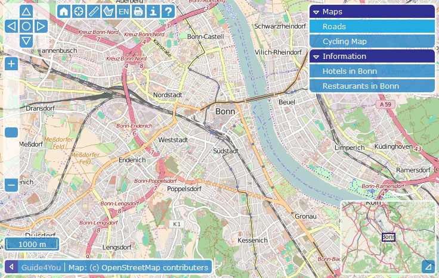
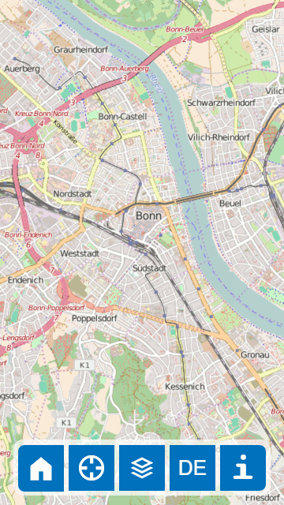

#  guide4you

[](https://npmjs.org/package/guide4you)
[](http://standardjs.com/)

**GUIDE4YOU** is a JavaScript Web client application built on [OpenLayers 3](http://openlayers.org)
that supports both desktop and mobile web browsers and features a responsive design.



For a screenshot of the mobile view [see below](#mobile-screenshot).

## What can GUIDE4YOU do for you?

With the basic system **GUIDE4YOU** can:

* Display maps like [Openstreetmap](https://openstreetmap.org), [OpenTopoMap](https://opentopomap.org), or [OpenCycleMap](http://www.thunderforest.com/maps/opencyclemap/)
* Use OSM, WMS, WFS, KML, GPX (others follow) 
* Measure areas and distances
* Display your location
* Print the current view on a single page
* Overlay a base map with points of interest and the like
* Configure a set of base maps and overlays to choose from
* Allow for different languages
* &hellip;

With additional modules it can also:

* [URLAPI module](https://github.com/KlausBenndorf/guide4you-module-urlapi): Generate links so you can share a certain view of a map. That view can include a location marker and a description of the location in question.
* [Search module](https://github.com/KlausBenndorf/guide4you-module-search): Search for locations using [Nominatim](https://nominatim.openstreetmap.org/). Alternatively you can customize this module to use other engines.
* Edit GPX data (coming soon)
* &hellip;

## Why use GUIDE4YOU?

Compared to alternative software **GUIDE4YOU** provides a couple of interesting features:

* Highly customizable
* Support for new languages can easily be added
* Icons are vector graphics (SVG) so they can be scaled to whatever size seems suitable
* No separate mobile and desktop versions
* Easily extensible

## Which browsers are supported?

All modern browsers including
* Firefox
* Chrome
* Edge and Internet Explorer 10+
* Safari

## How to build GUIDE4YOU?

First install all dependecies using

```
npm install
```

Then build with a configuration of your choice

```
npm run build conf/simple
```

If you want to develop you can use the dev server script, which listens on port 8080 by default
 
```
npm run dev conf/simple
```

## <a name="mobile-screenshot"></a>Mobile Screenshot


